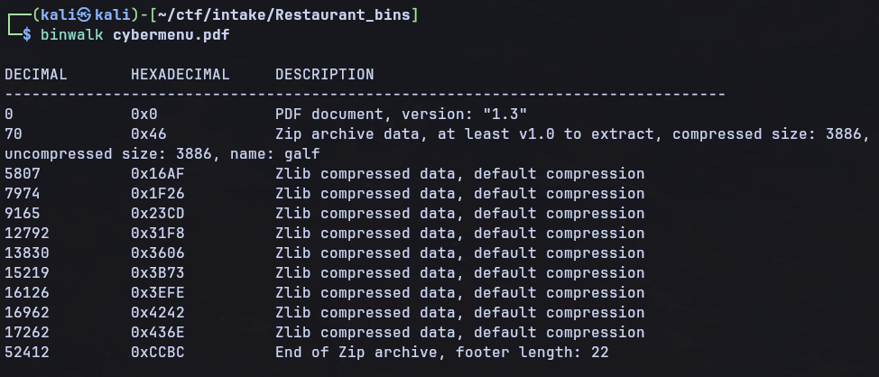

## Forensics: Lost Kittens <a id="lostkittens"></a>


For this challenge you are given a password protected zip file. There are a few different tools you could use to find the password and the description of the challenge gives you some hints to these:

- "Uncle john" points to using *JohnTheRipper*
- The cat theme implies using *hashcat*
- And not mentioned but is also very useful, *Fcrackzip*

&nbsp;  
For this writeup I'll be using John  
First you'll need to convert the zip file into a hash so john can use it:  


This gives us this hash:

```
cutecats.zip/flag.txt:$pkzip$1*2*2*0*24*18*c2206e41*0*42*0*24*69aa*715fb84390b2bd3a3111e9b2f2901f08154305389e09f1a742b18cfa9a01252031350f10*$/pkzip$:flag.txt:cutecats.zip::cutecats.zip
```

You are then able to perform a dictionary attack on this hash using either john or hashcat to get the password for the zip file


Finally we can unzip the zip file with the password we just cracked. This gives us our flag:

```
Intake{************}
```
&nbsp;

## Crypto: Grays Anatomy <a id="graysanatomy"></a>


For this challenge you're given a image of the outside of Nokia Bell Labs (this will be important later). The first part of this challenge is more forensics than crypto.


The first step of this challenge is to use a tool like stegseek to extract some data hidden in the image with steghide. (*Stegseek is used instead of a tool like stegcrack as it can get though the entire `rockyou.txt` word list in under 2 seconds*)


This gives us our password as *laboratory* and also extracts the data hidden in the image


From here you have to work out what to do with hex value, the hints for this are again in the the description, name and image themselves:

- The image being of Bell Labs
- The reference to *"1940s code"* in the challenge description
- And a reference to the name *"Gray"* in the challenge name


If you do some googling of "Bell Labs gray" and "Bell labs gray code" it brings you to something called *Gray Code* a form of binary invented by Frank Gray at Bell Labs in the 1940s  

The steps now to get the flag are relatively simple:
- Convert the hex value to binary
- Convert the binary Gray Code into regular binary
- Convert the normal binary back to ASCII

Converting the hex value to binary is easily done in python:


This Gray Code binary can then be converted into normal binary either by hand, or by using an online converter (https://miniwebtool.com/gray-code-to-binary-converter/)

This gives us the binary: 
```
1001001011011100111010001100001011010110110010101111011010001110111001000110100011110010110001100110000010001000011001101111101
```

We can then use python and convert this into ASCII to get out flag 


And we have our flag! `Intake{********}`

## Crypto: Restaurant Bins <a id="restaurantbins"></a>


Similar to the previous challenge Restaurant Bins also requires some forensics skills
We are provided with a PDF of a restaurant menu that looks rather odd. 


As this is a crypto challenge, and the food categories start with E, N and C we can deduce this must be an RSA public key and Ciphertext

```
n = 1754855759650743767503869076814946449161221988945131762860850650934071108812482091782335001129797246345434549300597877301537145147325064468164785608175471379078968621441495156606772561461558509057879621876000373425091440007085588096579926802504858667285971828686528584199545107883466940764934199625261666665931884490733946038296846835443564303448738988078440512324191145082259733656235195132033169599025641699987520612234682411135316700820536802549613720808179788357685065979943842888484188346443471888743404566343222752805220195244981753245299112164244421310576792854307658971133327513611085767555468854066669498201

e = 65537

c = 976472116213844252006772134451713181631658844547136414857329203034680040811599685629763238060874017281918117213658307964298764499851693935835870053757460768067434212982393979507963370800798231014610650752771397467193768527313830310350459257436027573793215274884137753800025807811477984329498355254577494198073252872348439004352751462707204032492187194589319158054395909577521778438872389524201676332819649475050365447352778997068837222713501344553240199665763776974649426720151026726841857051591916784572653732604439089885366234361986676896880965141300956303447027787037449232561528986650866859218077531435548086587
```
To break RSA ideally we need to be able to facotrise N, this allows us to find P and Q then derive the private key and decrypt the message. The derevation of the private key is shown below

$$p = largeprime, q = largeprime$$

$$n = p * q$$

$$\phi(n) = (p-1)(q-1)$$

*d* is to be the modular multiplicative inverse of *e* modulo *ϕ(n)* such that:

$$d * e \equiv 1 \mod \phi(n)$$ 

$$d = e^{-1} \mod \phi(n)$$

So we need to be able to factorise *n* to be able to find *d*. If we try to factorise *n* using a website such as http://factordb.com/ we'll find that its unable to factorise *n*. Instead we can use something called Fermats Factorisation Method. This is detailed very well in the computerphile video [Breaking RSA](https://www.youtube.com/watch?v=-ShwJqAalOk&t=9s) and in [Hanno Böck's Blog](https://fermatattack.secvuln.info/). This takes advantage that *p* and *q* may be poorly generated and be very close to eachother (with only around the least sigificant 500 bits different).

The method is based of the fact that you can write an odd integer as a difference of two squares:  


$$N = a^2 - b^2$$

$$N = (a+b)(a-b)$$

$$\text{Where } (a+b) = p \text{ and } (a-b) = q$$

We can then rewrite the top equation as:

$$b^2 = a^2 - N$$

The core of the algorithm is to take a educated guess at *a*, say the square root of *a* (the ceiling of this number), and iterate up until you find that *b* is a perfect square. When you find that *b* is a perfect square then you are able to calculate *p* and *q*.

Below is a python solve script to caluclate *p* and *q* using this method, then calculate the private key and and decrypt the message (*You don't actually need to script this to solve this challenge, theres a great tool called [RsaCtfTool](https://github.com/RsaCtfTool/RsaCtfTool) that is able to also perform fermats factorisation method along with many other different RSA attacks. I just though it would nice to see whats actually happening under the hood*):

```python
from math import isqrt
from Crypto.Util.number import inverse


n = 1754855759650743767503869076814946449161221988945131762860850650934071108812482091782335001129797246345434549300597877301537145147325064468164785608175471379078968621441495156606772561461558509057879621876000373425091440007085588096579926802504858667285971828686528584199545107883466940764934199625261666665931884490733946038296846835443564303448738988078440512324191145082259733656235195132033169599025641699987520612234682411135316700820536802549613720808179788357685065979943842888484188346443471888743404566343222752805220195244981753245299112164244421310576792854307658971133327513611085767555468854066669498201
e = 65537
c = 976472116213844252006772134451713181631658844547136414857329203034680040811599685629763238060874017281918117213658307964298764499851693935835870053757460768067434212982393979507963370800798231014610650752771397467193768527313830310350459257436027573793215274884137753800025807811477984329498355254577494198073252872348439004352751462707204032492187194589319158054395909577521778438872389524201676332819649475050365447352778997068837222713501344553240199665763776974649426720151026726841857051591916784572653732604439089885366234361986676896880965141300956303447027787037449232561528986650866859218077531435548086587 

# Uses Fermat's factorization method to factor n to find p and q
a = isqrt(n) + 1
while True:
  b2 = (a*a) - n
  b = int(isqrt(b2))
  if (b * b == b2):
    break
  a += 1

p = a + b
q = a - b


# Calculate d such that e*d = 1 mod phi(n)
phi_n = int((p-1) * (q-1))
d = inverse(e,phi_n)

# Decrypt ciphertext using M = C^d mod n
dec = bytes.fromhex(hex(pow(c,d,n))[2:]).decode("utf8")

print(dec)
```

This then gives us 
```
pass:for_the_most_walk_the_bins
```

As you might notice this is not the key. However it does give you hints on how to find the key. The password is a reference to two tools, foremost and binwalk. These allow you to extract files hidden within other files. 

We'll try binwalk on the PDF to see if there are any hidden files



We can see that there is a hidden zip file inside the PDF called *galf*. If we extract this we can see what *galf* is by using the `file` command. 


Galf appears to be some GPG encypted data, if you remeber before the RSA we decrypted seemed to be a password, so if we decrypt *galf* using the password `for_the_most_walk_the_bins` we'll get the flag

After decryping galf with `$ gpg galf` we get the flag:

```
Intake{***********}
```
