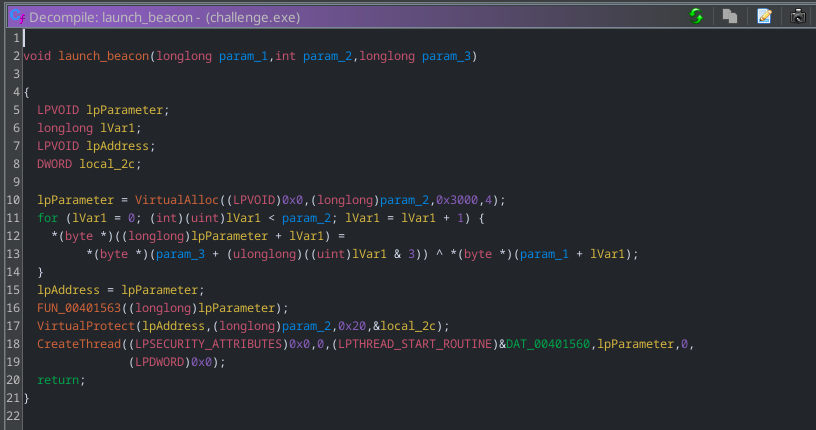
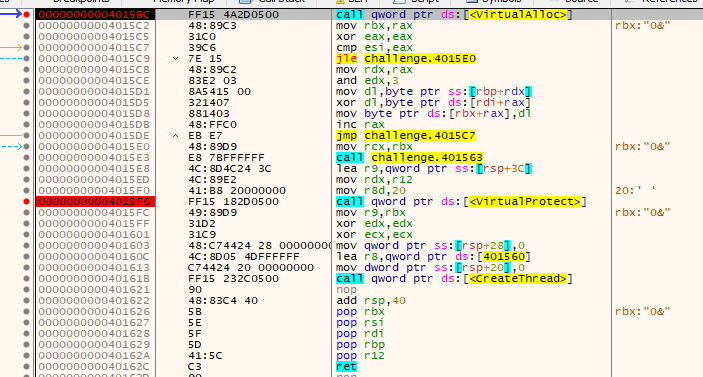
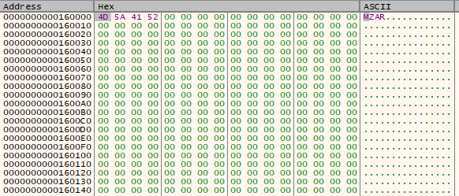
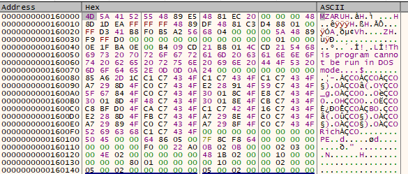
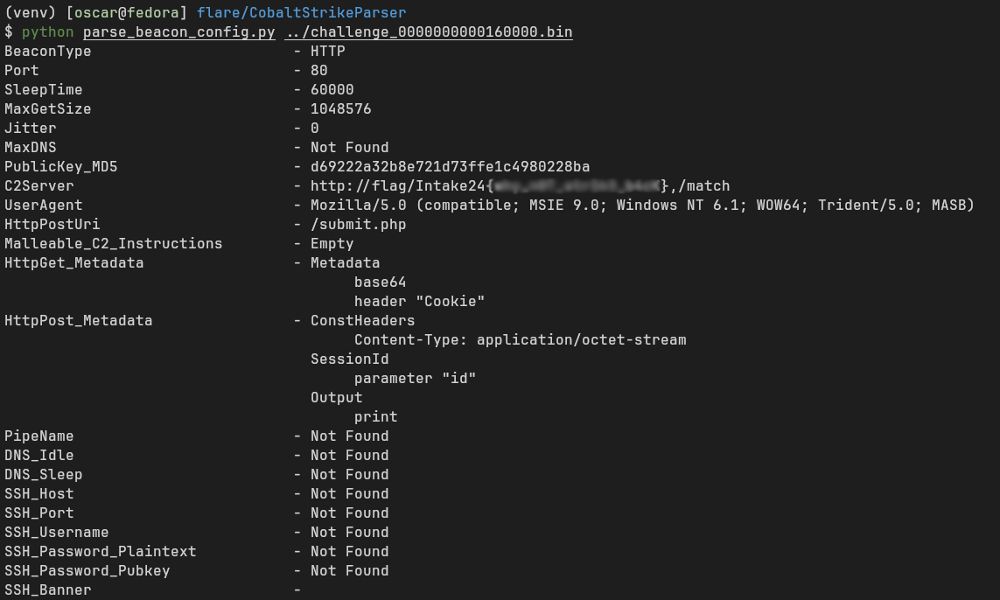

## Rev: Flare <a id="Flare"></a>


I understand that is challenge may seem **very** scary at first, with it being Windows malware - but once you figure out what the malware is, the challenge is very pretty straightforward :)

You're given a Windows binary called challenge.exe, the easiest way to figure out what this binary is is to put it into VirusTotal - this then shows you the binary is something to do with cobalt strike and beacons. Cobalt Strike is a popular C2 framework developed by Fortra and the binary is in fact a beacon loader - a program that launches a beacon when run on a target machine. If you had Windows Defender enabled on your VM when putting the binary on it, it would also tell you :P


Now if you were smart with this you could have utilised some neat automated tools to pull out the flag from the binary - VirusTotal has these tools built into its behaviours tab where it pulls and parses the beacon config. However, that no funnnnn :(((

So were going to be doing it the cooooler way by analysing the binary, finding where the beacon code is executed and pulling out the config from memory. 

When you come across a Cobalt Strike beacon needing to be looked at, the most interesting thing that it contains is the beacon config - this stores all the C2 configuration and C2 servers that the beacon uses to phone home. So our goal is to find this beacon config.

Putting the binary into Ghidra, doing some digging and looking into some interesting kernel32.dll functions often used in malware (virtualalloc, virtualprotect, createthread). You will end up coming across some function calling all three to create a thread from a region on memory that VirtualProtect() marks as executable. Some data from the 1st function parameter is xor'd with data from param3 - this is "decrypting" our beacon code with a xor key and storing it in the region created by VirtualALloc. This seem *very* interesting and is something to look at further.  



This next step can be done statically, however that would putting yourself through more pain that its worth. The much easier route is do this dynamically, by debugging the binary and pulling the binary that gets run in the thread from memory (hense why you needed to do this in a VM, didnt wanna infect ppl :D).

The tools I'll be using is a Windows 10 VM and the x64dbg debugger (you could also use windbg). You will want to have 2 breakpoints where VirualAlloc() is called and where VirtualProtect() is called. 




If you run the VirtualAlloc() instruction you'll notice that RAX has been set to an address (in this case 0x160000) - this is the address of buffer that the the beacon code will be stored. If you step through the next xor instructions and follow the address in RAX in a dump you'll notice that the first 2 bytes decrypted are 'MZ' - the magic number of a windows PE file (windows executable program)!! The beacon code is being decrypted!!




From this point run the program so you hit the next breakpoint at VirtualProtect(). Now you want to get this beacon binary out of memory, to do this you can use a cool feature to dump a memory region to a file (right click on the dump -> follow in mem map, right click on 0x16000 -> dump to file).



Now you have the real heart of the beacon code - this is the real binary that contains the config. There are 2 ways to get the config, load it up into a hex editor find the xoring key used and xor the region in the binary that contains the config, or [SentinelOne makes a tool](https://github.com/Sentinel-One/CobaltStrikeParser) that can do that all for you (i will be using that :))

It's as simple as running the tool with the beacon pulled from memory and you get the flag!



```
Intake24{**************}
```
